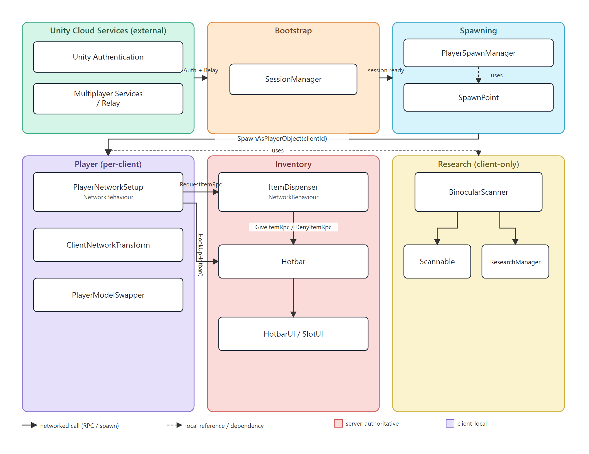

# System Architecture

How the game's major systems are structured and how they communicate, both locally and over the network (Unity Netcode for GameObjects, transported via Unity Multiplayer Services / Relay).

---

## 1. High-level diagram

Laid out in two rows sized to landscape US Letter paper (`System-Architecture.svg`, 11"×8.5" at 96dpi) so it prints on a single page — open the `.svg` directly and print at 100% scale for the sharpest result; the `.png` is a same-layout raster fallback for tools that don't render inline SVG.

**Notes on the diagram:**

- **Top row = one-time bootstrap.** A client authenticates and gets a Relay session (Unity Cloud Services), the local `SessionManager` reports "session ready," and the server-side `PlayerSpawnManager` picks a spawn point. This runs once per player joining, not every frame.
- **Bottom row = the running game**, once that player object exists: `Player`, `Inventory`, and `Research` are the systems doing actual gameplay logic.
- **The two dashed/solid lines between the rows** are the only links connecting bootstrap to gameplay: `SpawnAsPlayerObject(clientId)` is the literal handoff that creates the player, and the "uses" line just shows `PlayerNetworkSetup` reaching for the `BinocularScanner` already sitting on the player prefab (not a network call).
- **Color = ownership, not just grouping.** Purple (Player) and yellow (Research) are client-local — each client only sees its own copy. Pink (Inventory) contains the one server-authoritative piece (`ItemDispenser`); everything else in that box is just UI reacting to it.
- **Solid arrows are real network traffic** (an RPC or a `NetworkObject` spawn call); **dashed arrows are plain C# references** resolved locally, no network involved — that distinction is why `ItemDispenser`'s two solid arrows to `Hotbar` are the only genuinely networked exchange in the whole diagram (see §3 for the full request/reply trace).

## 2. Systems and where authority lives

| System | Key scripts | Runs on | Notes |
|---|---|---|---|
| **Unity Cloud Services** | *(external, not our code)* | Cloud | Unity Authentication issues the anonymous identity; Multiplayer Services/Relay brokers the session code and relays traffic between host and clients so no one needs a public IP/port-forwarding. Everything downstream depends on these two calls succeeding first. |
| **Session bootstrap** | `SessionManager` | Every client (host + joiners) | Wraps Unity Authentication + Multiplayer Services. Signs in anonymously, then `CreateSession`/`JoinSessionByCodeAsync` over Relay. Singleton, `DontDestroyOnLoad`. |
| **Spawning** | `PlayerSpawnManager`, `SpawnPoint` | Server/host only calls `SpawnNetworkedPlayer` | Picks a spawn-point group once per session, then hands out points by strategy (Random/RoundRobin/First). Calls `NetworkObject.SpawnAsPlayerObject(clientId)` — this is what makes the player object server-owned-but-client-controlled. |
| **Player** | `PlayerNetworkSetup`, `ClientNetworkTransform`, `PlayerModelSwapper` | Split: logic runs everywhere, effects gated by `IsOwner` | On `OnNetworkSpawn`, non-owned instances get their camera/input disabled so remote players don't fight the owner's Cinemachine brain. The owner's own camera is enabled a frame later, after everyone else's is confirmed off. |
| **Inventory (UI/state)** | `Hotbar`, `HotbarUI`, `SlotUI`, `IEquippable` | Client-local | Not a `NetworkBehaviour`. Each client's hotbar only reflects that client's items. `HotbarUI` lives on a scene `Canvas`, so `PlayerNetworkSetup`/`PlayerSpawnManager` reach in and wire `hotbar.hotbarUI` post-spawn, then call `RefreshUI()`. |
| **Item dispenser** | `ItemDispenser` | `NetworkBehaviour`, server-authoritative | The one place inventory actually crosses the network. Server owns the pool (`_remaining`); a `NetworkVariable<int>` mirrors the remaining count to all clients for UI ("Press E" vs "Empty") without them needing to ask. |
| **Research** | `BinocularScanner`, `Scannable`, `ResearchManager` | Client-local, not networked | Self-contained scan-and-fill loop; no RPCs. Would need networking added if scan progress/completion should be shared across players. |

## 3. Key request/response flow: taking an item from a dispenser

This is the only bidirectional client↔server exchange in the project today, so it's worth tracing in full:

1. Client walks into the dispenser's trigger collider → `OnTriggerEnter` grabs that player's `Hotbar` (only for objects the client owns — remote players' triggers are ignored via `NetworkObject.IsOwner`).
2. Client presses **E** → if a hotbar slot is free and the synced `_remainingCount` is > 0, sends `RequestItemRpc` (`SendTo.Server`).
3. **Server** picks a random remaining index, removes it from `_remaining`, updates `_remainingCount` (auto-replicates to all clients), and replies with `GiveItemRpc` targeted at just the requesting client (`RpcTarget.Single`).
4. **Requesting client** receives the item index and calls `Hotbar.AddItem`. If the hotbar filled up while the request was in flight, it calls `ReturnItemRpc` back to the server to put the item back in the pool instead of dropping it.

This request/reply-with-rollback pattern is the template to reuse for any future networked pickup/interaction — keep the server as the single source of truth for anything shared (the pool), and let `NetworkVariable`s carry only the read-only bits every client needs for UI.

## 4. Non-networked systems

`Research/*` and the hotbar UI rendering are purely client-local — they don't need the network layer at all right now. If multiplayer research (e.g., shared progress) is added later, it would follow the same shape as the dispenser: server holds the authoritative value, a `NetworkVariable` mirrors it out for display, RPCs handle the action requests.
